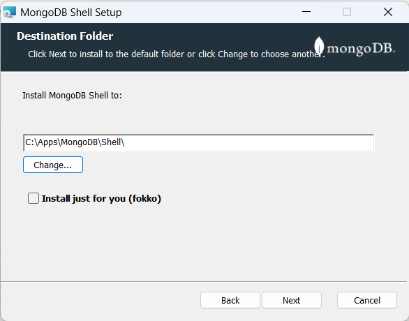

# MongoDB Shell Installation Guide <!-- omit in toc -->

## Contents <!-- omit in toc -->

- [Installation](#installation)
- [Adding to PATH](#adding-to-path)

The MongoDB Shell is a command-line interface tool for MongoDB. It enables the performance of administrative tasks and queries on a MongoDB instance.

## Installation

To install the MongoDB Shell, download it from the [MongoDB Download Center](https://www.mongodb.com/try/download/shell).

Note the installation directory during installation. For ease of access, you can include this directory in your `PATH` environment variable. This allows you to launch the MongoDB Shell from any directory.

In my setup, the MongoDB Shell is located in the `C:\Apps\MongoDB\Shell` directory. I have included this path in my `PATH` environment variable.

## Adding to PATH

To add the MongoDB Shell to your `PATH` environment variable, follow these steps:

1. Open the Start Menu and search for `environment variables`.
2. Click on `Edit the system environment variables`.
3. Select `Environment Variables...`.
4. In the `System variables` section, choose `Path` and click `Edit...`.
5. Click the `New` button and enter the MongoDB Shell installation directory.
6. Click `OK` to save your changes.
7. To confirm the installation, open a new command prompt and execute `mongosh --version`.