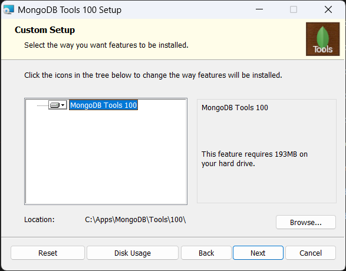

# MongoDB Tools Installation Guide <!-- omit in toc -->

MongoDB Tools comprises a set of command-line utilities designed for interacting with a MongoDB deployment. These tools include:

- `bsondump` - Renders BSON files in a format that is easy to read.
- `mongoimport` - Transforms data from JSON, TSV, or CSV formats and inserts them into a MongoDB collection.
- `mongoexport` - Exports data from an existing collection into CSV or JSON format.
- `mongodump` - Creates a binary dump file of a database's contents.
- `mongorestore` - Restores data from a backup created by `mongodump`.
- `mongostat` - Provides real-time monitoring of MongoDB servers, including replica sets and sharded clusters.
- `mongotop` - Tracks and reports read/write operations on a MongoDB instance.
- `mongofiles` - Manages files in GridFS, supporting read, write, delete, and update operations.

## Contents <!-- omit in toc -->

- [Installation](#installation)
- [Adding to PATH](#adding-to-path)

## Installation

MongoDB Tools can be downloaded from the [MongoDB Download Center](https://www.mongodb.com/try/download/database-tools).

During installation, it's important to note the installation directory. This path will later be required to set up your `PATH` environment variable.

For example, in my setup, I installed the tools at `C:\Apps\MongoDB\Tools\100\bin` and subsequently added this path to my `PATH` environment variable.

## Adding to PATH

To include MongoDB Tools in your `PATH` environment variable on Windows, follow these instructions:

1. Open the Start menu and search for `environment variables`.
2. Select `Edit the system environment variables`.
3. Choose `Environment Variables...`.
4. In the `System variables` section, locate and select the `Path` variable, then click `Edit...`.
5. Press `New` and enter the path to your MongoDB Tools installation directory.
6. Confirm your changes by clicking `OK` on all open windows.
7. To verify the installation, open a new command prompt and enter `mongodump --version`.